# UML Exercises

The diagrams are written in Mermaid, so GitHub draws them automatically.
Mermaid has no real use case diagram, so those are drawn as flowcharts with a system boundary.

# Exo 1 - Hospital Management System

## Exo 1 Task 1: Class diagram (Patient, Doctor, Organizer)

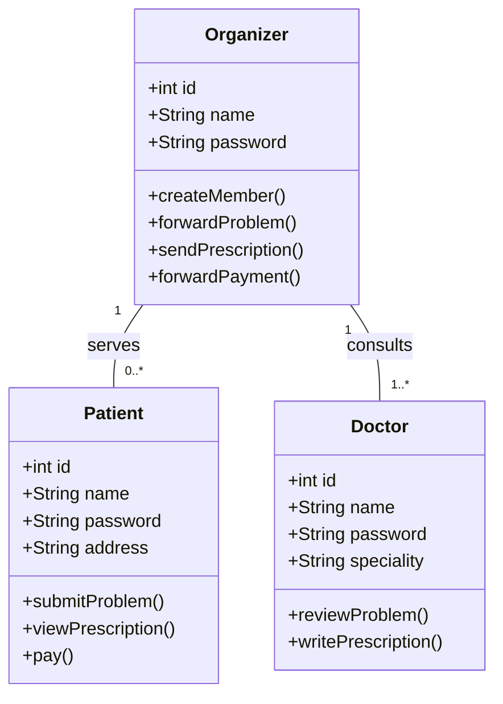
```mermaid
classDiagram
    class Patient {
        +int id
        +String name
        +String password
        +String address
        +submitProblem()
        +viewPrescription()
        +pay()
    }
    class Doctor {
        +int id
        +String name
        +String password
        +String speciality
        +reviewProblem()
        +writePrescription()
    }
    class Organizer {
        +int id
        +String name
        +String password
        +createMember()
        +forwardProblem()
        +sendPrescription()
        +forwardPayment()
    }
    Organizer "1" -- "0..*" Patient : serves
    Organizer "1" -- "1..*" Doctor : consults
```

## Exo 1 Task 2: Complete class diagram and sequence diagram

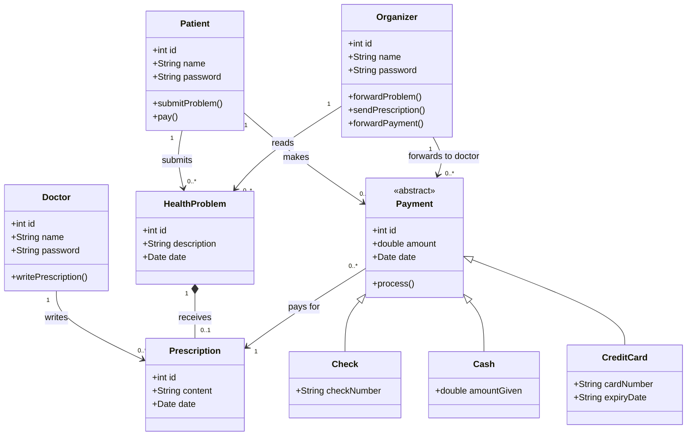
```mermaid
classDiagram
    class Patient {
        +int id
        +String name
        +String password
        +submitProblem()
        +pay()
    }
    class Doctor {
        +int id
        +String name
        +String password
        +writePrescription()
    }
    class Organizer {
        +int id
        +String name
        +String password
        +forwardProblem()
        +sendPrescription()
        +forwardPayment()
    }
    class HealthProblem {
        +int id
        +String description
        +Date date
    }
    class Prescription {
        +int id
        +String content
        +Date date
    }
    class Payment {
        <<abstract>>
        +int id
        +double amount
        +Date date
        +process()
    }
    class Check {
        +String checkNumber
    }
    class Cash {
        +double amountGiven
    }
    class CreditCard {
        +String cardNumber
        +String expiryDate
    }
    Patient "1" --> "0..*" HealthProblem : submits
    Organizer "1" --> "0..*" HealthProblem : reads
    Doctor "1" --> "0..*" Prescription : writes
    HealthProblem "1" *-- "0..1" Prescription : receives
    Patient "1" --> "0..*" Payment : makes
    Payment "0..*" --> "1" Prescription : pays for
    Organizer "1" --> "0..*" Payment : forwards to doctor
    Payment <|-- Check
    Payment <|-- Cash
    Payment <|-- CreditCard
```

Sequence diagram: a patient submits a problem, receives a prescription and pays.

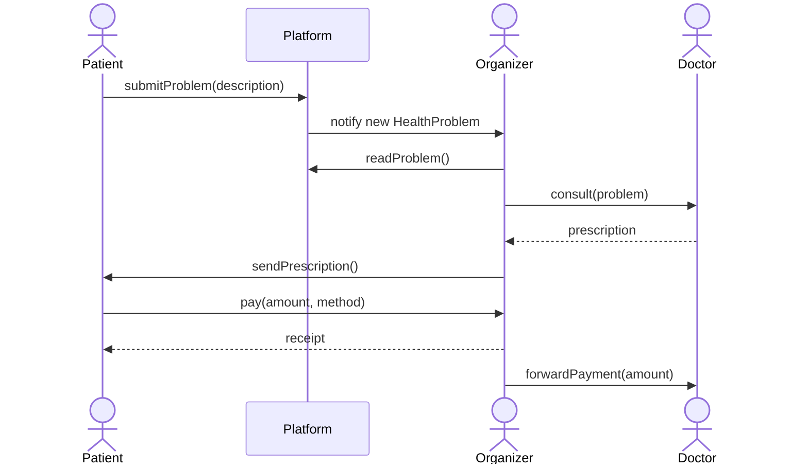
```mermaid
sequenceDiagram
    actor P as Patient
    participant S as Platform
    actor O as Organizer
    actor D as Doctor
    P->>S: submitProblem(description)
    S->>O: notify new HealthProblem
    O->>S: readProblem()
    O->>D: consult(problem)
    D-->>O: prescription
    O->>P: sendPrescription()
    P->>O: pay(amount, method)
    O-->>P: receipt
    O->>D: forwardPayment(amount)
```

## Exo 1 Task 3: Advanced

Class diagram with a User superclass, a status enumeration, timestamps, past prescriptions and a payment strategy.

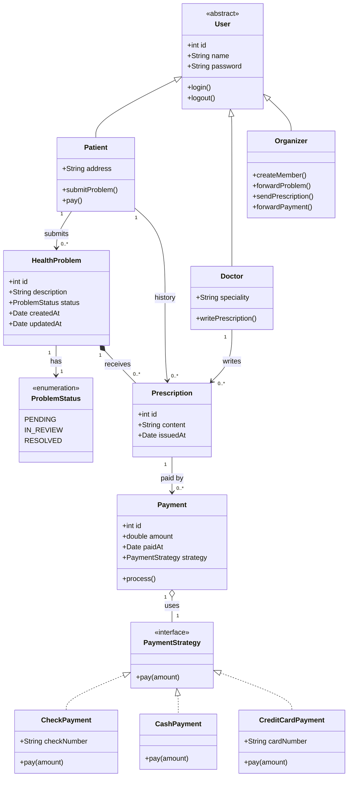
```mermaid
classDiagram
    class User {
        <<abstract>>
        +int id
        +String name
        +String password
        +login()
        +logout()
    }
    class Patient {
        +String address
        +submitProblem()
        +pay()
    }
    class Doctor {
        +String speciality
        +writePrescription()
    }
    class Organizer {
        +createMember()
        +forwardProblem()
        +sendPrescription()
        +forwardPayment()
    }
    class HealthProblem {
        +int id
        +String description
        +ProblemStatus status
        +Date createdAt
        +Date updatedAt
    }
    class ProblemStatus {
        <<enumeration>>
        PENDING
        IN_REVIEW
        RESOLVED
    }
    class Prescription {
        +int id
        +String content
        +Date issuedAt
    }
    class Payment {
        +int id
        +double amount
        +Date paidAt
        +PaymentStrategy strategy
        +process()
    }
    class PaymentStrategy {
        <<interface>>
        +pay(amount)
    }
    class CheckPayment {
        +String checkNumber
        +pay(amount)
    }
    class CashPayment {
        +pay(amount)
    }
    class CreditCardPayment {
        +String cardNumber
        +pay(amount)
    }
    User <|-- Patient
    User <|-- Doctor
    User <|-- Organizer
    Patient "1" --> "0..*" HealthProblem : submits
    Patient "1" --> "0..*" Prescription : history
    Doctor "1" --> "0..*" Prescription : writes
    HealthProblem "1" --> "1" ProblemStatus : has
    HealthProblem "1" *-- "0..*" Prescription : receives
    Prescription "1" --> "0..*" Payment : paid by
    Payment "1" o-- "1" PaymentStrategy : uses
    PaymentStrategy <|.. CheckPayment
    PaymentStrategy <|.. CashPayment
    PaymentStrategy <|.. CreditCardPayment
```

System sequence diagram 1: Patient registration.

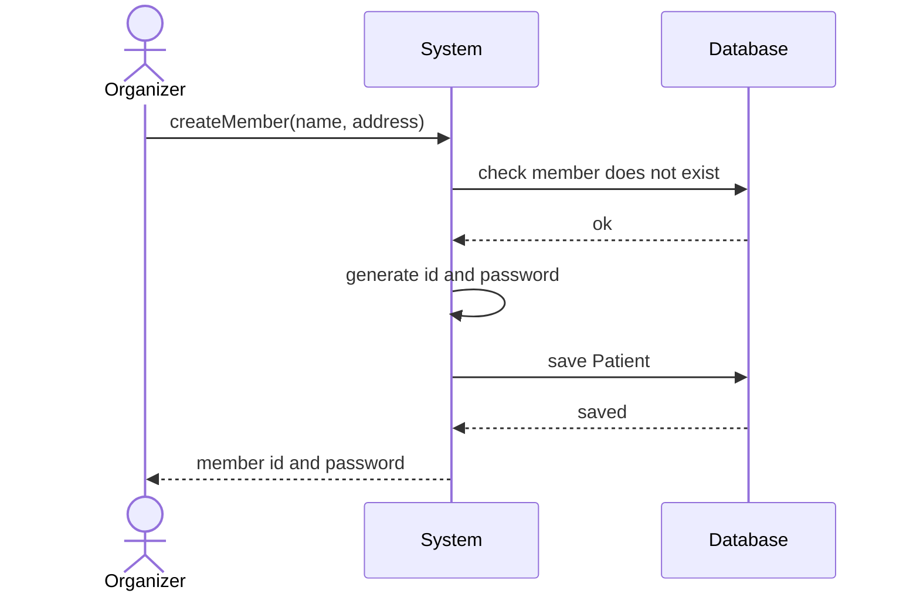
```mermaid
sequenceDiagram
    actor O as Organizer
    participant S as System
    participant DB as Database
    O->>S: createMember(name, address)
    S->>DB: check member does not exist
    DB-->>S: ok
    S->>S: generate id and password
    S->>DB: save Patient
    DB-->>S: saved
    S-->>O: member id and password
```

System sequence diagram 2: Consultation flow.

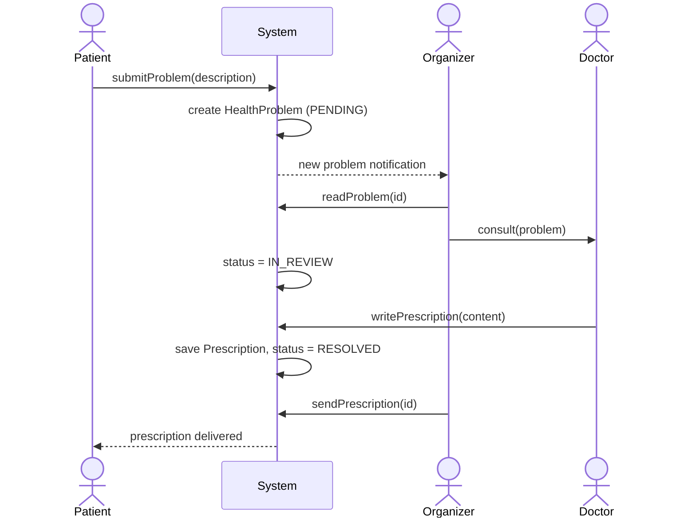
```mermaid
sequenceDiagram
    actor P as Patient
    participant S as System
    actor O as Organizer
    actor D as Doctor
    P->>S: submitProblem(description)
    S->>S: create HealthProblem (PENDING)
    S-->>O: new problem notification
    O->>S: readProblem(id)
    O->>D: consult(problem)
    S->>S: status = IN_REVIEW
    D->>S: writePrescription(content)
    S->>S: save Prescription, status = RESOLVED
    O->>S: sendPrescription(id)
    S-->>P: prescription delivered
```

System sequence diagram 3: Payment processing.

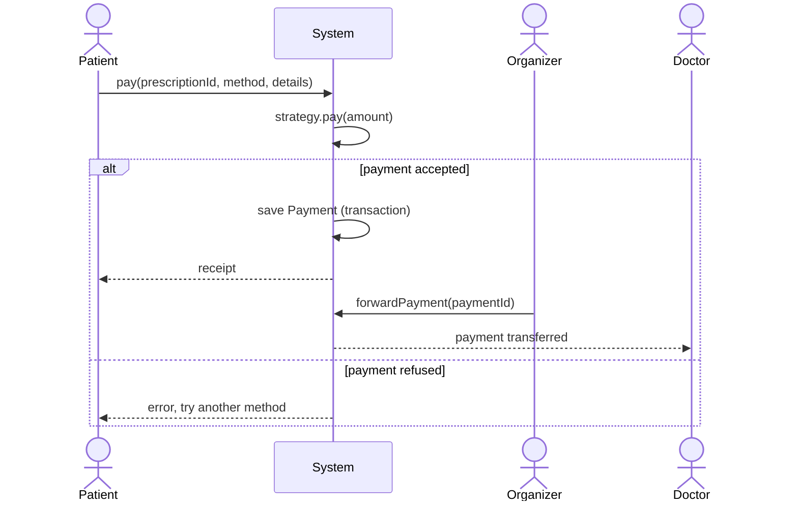
```mermaid
sequenceDiagram
    actor P as Patient
    participant S as System
    actor O as Organizer
    actor D as Doctor
    P->>S: pay(prescriptionId, method, details)
    S->>S: strategy.pay(amount)
    alt payment accepted
        S->>S: save Payment (transaction)
        S-->>P: receipt
        O->>S: forwardPayment(paymentId)
        S-->>D: payment transferred
    else payment refused
        S-->>P: error, try another method
    end
```

### Questions to consider

- **A patient consulting several doctors:** the relation HealthProblem to Prescription is 0..* and each Prescription has its own Doctor, so one problem can have several prescriptions from different doctors, and the patient keeps a full history.
- **Reusable prescriptions:** keep a Prescription template (content only) and create a new Prescription record from it for each patient, with a new date and a reference to the template.
- **Design pattern for payments:** the Strategy pattern. Payment uses a PaymentStrategy interface, so a new payment method only needs a new class.
- **Data integrity:** process each payment in a database transaction (all or nothing), check the amount before saving, never delete payments (only mark them), and give each payment a unique id so it can't be forwarded twice.

# Exo 2 - ABCD Records

## Exo 2 Level 1 Task 1.1: Use case diagram

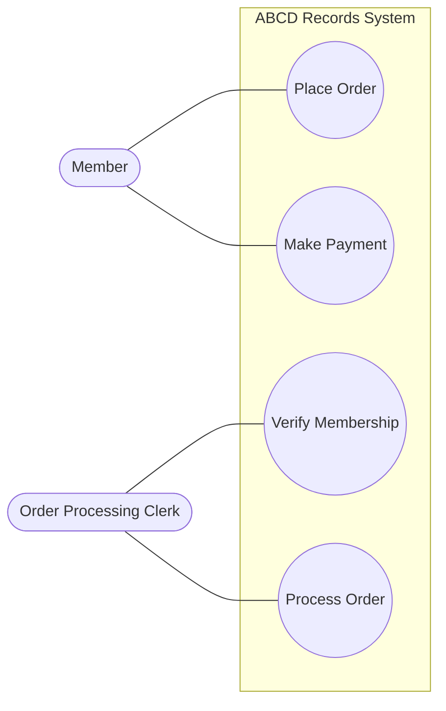
```mermaid
flowchart LR
    Member([Member])
    Clerk([Order Processing Clerk])
    subgraph ABCD[ABCD Records System]
        PO((Place Order))
        VM((Verify Membership))
        PrO((Process Order))
        MP((Make Payment))
    end
    Member --- PO
    Member --- MP
    Clerk --- VM
    Clerk --- PrO
```

## Exo 2 Level 1 Task 1.2: Class diagram

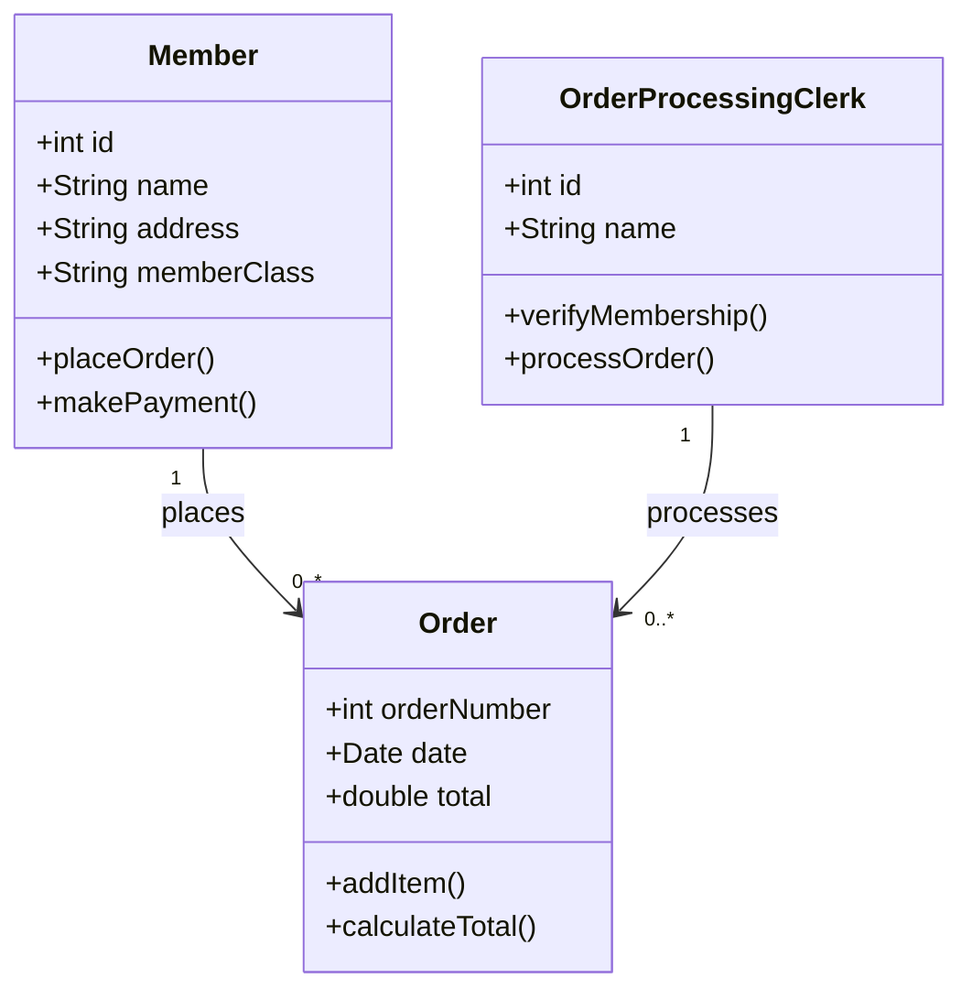
```mermaid
classDiagram
    class Member {
        +int id
        +String name
        +String address
        +String memberClass
        +placeOrder()
        +makePayment()
    }
    class Order {
        +int orderNumber
        +Date date
        +double total
        +addItem()
        +calculateTotal()
    }
    class OrderProcessingClerk {
        +int id
        +String name
        +verifyMembership()
        +processOrder()
    }
    Member "1" --> "0..*" Order : places
    OrderProcessingClerk "1" --> "0..*" Order : processes
```

## Exo 2 Level 2 Task 2.1: Complete use case diagram

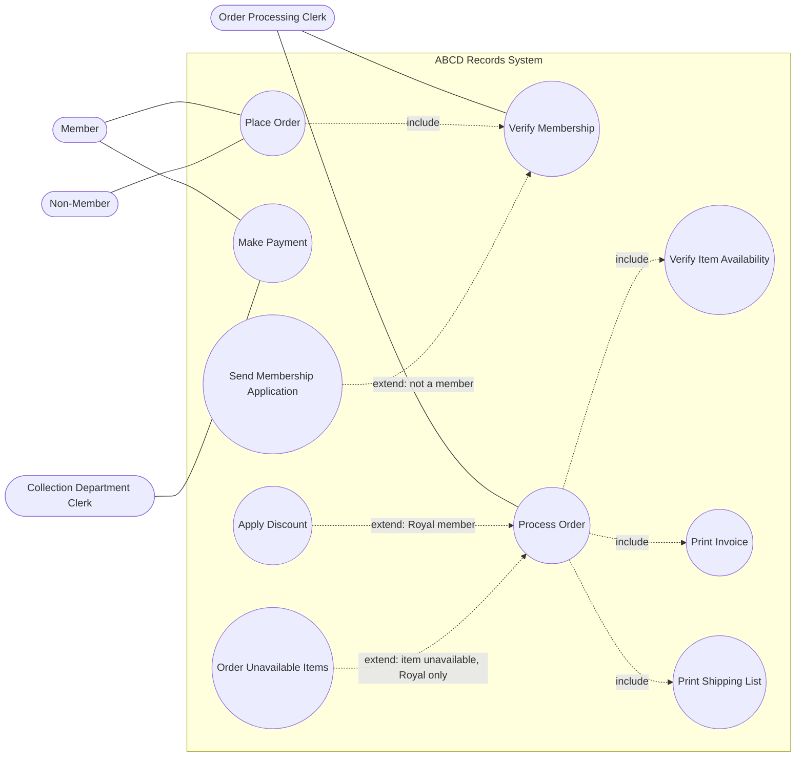
```mermaid
flowchart LR
    Member([Member])
    NonMember([Non-Member])
    OPC([Order Processing Clerk])
    CDC([Collection Department Clerk])
    subgraph ABCD[ABCD Records System]
        PO((Place Order))
        VM((Verify Membership))
        PrO((Process Order))
        MP((Make Payment))
        VIA((Verify Item Availability))
        AD((Apply Discount))
        PI((Print Invoice))
        PSL((Print Shipping List))
        OUI((Order Unavailable Items))
        SMA((Send Membership Application))
    end
    Member --- PO
    Member --- MP
    NonMember --- PO
    OPC --- VM
    OPC --- PrO
    CDC --- MP
    PO -.->|include| VM
    PrO -.->|include| VIA
    PrO -.->|include| PI
    PrO -.->|include| PSL
    AD -.->|extend: Royal member| PrO
    OUI -.->|extend: item unavailable, Royal only| PrO
    SMA -.->|extend: not a member| VM
```

## Exo 2 Level 2 Task 2.2: Complete class diagram

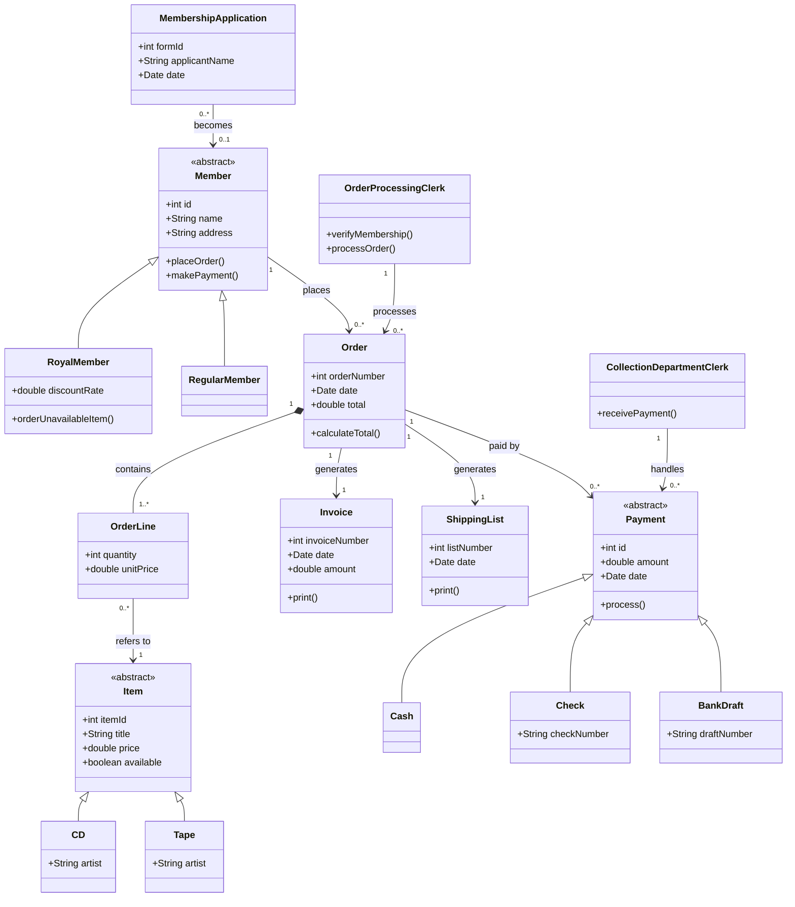
```mermaid
classDiagram
    class Member {
        <<abstract>>
        +int id
        +String name
        +String address
        +placeOrder()
        +makePayment()
    }
    class RoyalMember {
        +double discountRate
        +orderUnavailableItem()
    }
    class RegularMember {
    }
    class Order {
        +int orderNumber
        +Date date
        +double total
        +calculateTotal()
    }
    class OrderLine {
        +int quantity
        +double unitPrice
    }
    class Item {
        <<abstract>>
        +int itemId
        +String title
        +double price
        +boolean available
    }
    class CD {
        +String artist
    }
    class Tape {
        +String artist
    }
    class Invoice {
        +int invoiceNumber
        +Date date
        +double amount
        +print()
    }
    class ShippingList {
        +int listNumber
        +Date date
        +print()
    }
    class Payment {
        <<abstract>>
        +int id
        +double amount
        +Date date
        +process()
    }
    class Cash
    class Check {
        +String checkNumber
    }
    class BankDraft {
        +String draftNumber
    }
    class MembershipApplication {
        +int formId
        +String applicantName
        +Date date
    }
    class OrderProcessingClerk {
        +verifyMembership()
        +processOrder()
    }
    class CollectionDepartmentClerk {
        +receivePayment()
    }
    Member <|-- RoyalMember
    Member <|-- RegularMember
    Item <|-- CD
    Item <|-- Tape
    Payment <|-- Cash
    Payment <|-- Check
    Payment <|-- BankDraft
    Member "1" --> "0..*" Order : places
    Order "1" *-- "1..*" OrderLine : contains
    OrderLine "0..*" --> "1" Item : refers to
    Order "1" --> "1" Invoice : generates
    Order "1" --> "1" ShippingList : generates
    Order "1" --> "0..*" Payment : paid by
    OrderProcessingClerk "1" --> "0..*" Order : processes
    CollectionDepartmentClerk "1" --> "0..*" Payment : handles
    MembershipApplication "0..*" --> "0..1" Member : becomes
```

Scenario: a Royal member orders 2 CDs (one unavailable) and pays by check.

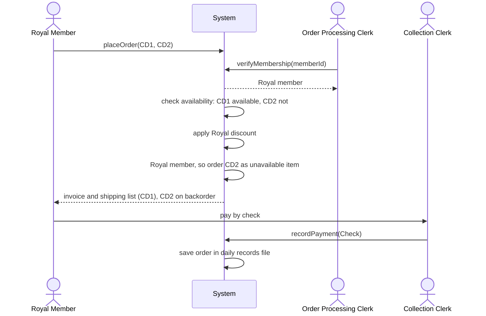
```mermaid
sequenceDiagram
    actor M as Royal Member
    participant S as System
    actor OPC as Order Processing Clerk
    actor CDC as Collection Clerk
    M->>S: placeOrder(CD1, CD2)
    OPC->>S: verifyMembership(memberId)
    S-->>OPC: Royal member
    S->>S: check availability: CD1 available, CD2 not
    S->>S: apply Royal discount
    S->>S: Royal member, so order CD2 as unavailable item
    S-->>M: invoice and shipping list (CD1), CD2 on backorder
    M->>CDC: pay by check
    CDC->>S: recordPayment(Check)
    S->>S: save order in daily records file
```

## Exo 2 Level 3: Sequence diagrams

Complete order processing flow.

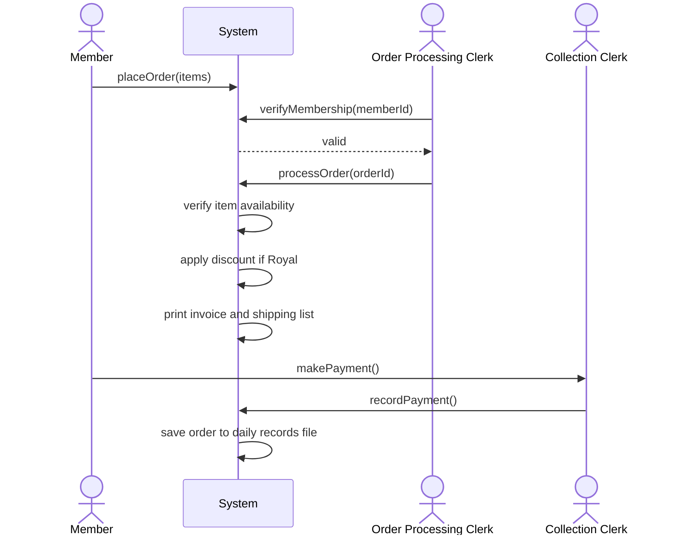
```mermaid
sequenceDiagram
    actor M as Member
    participant S as System
    actor OPC as Order Processing Clerk
    actor CDC as Collection Clerk
    M->>S: placeOrder(items)
    OPC->>S: verifyMembership(memberId)
    S-->>OPC: valid
    OPC->>S: processOrder(orderId)
    S->>S: verify item availability
    S->>S: apply discount if Royal
    S->>S: print invoice and shipping list
    M->>CDC: makePayment()
    CDC->>S: recordPayment()
    S->>S: save order to daily records file
```

Membership verification (success and failure).

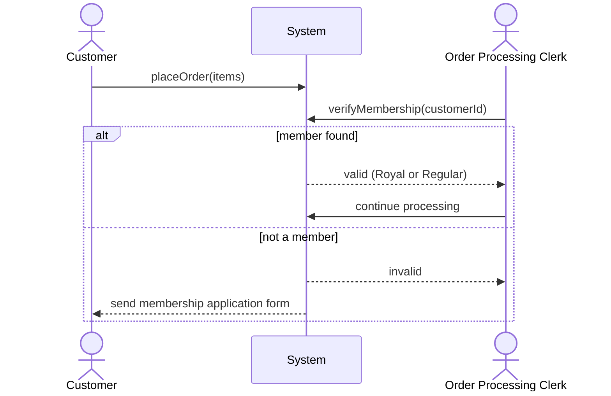
```mermaid
sequenceDiagram
    actor C as Customer
    participant S as System
    actor OPC as Order Processing Clerk
    C->>S: placeOrder(items)
    OPC->>S: verifyMembership(customerId)
    alt member found
        S-->>OPC: valid (Royal or Regular)
        OPC->>S: continue processing
    else not a member
        S-->>OPC: invalid
        S-->>C: send membership application form
    end
```

Payment processing (all types).

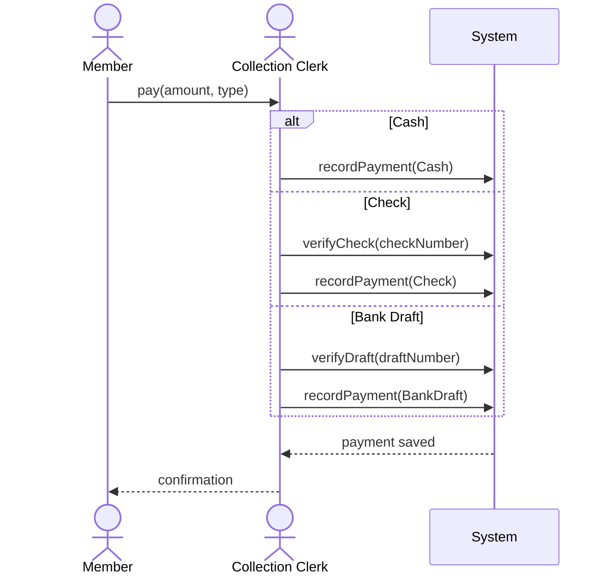
```mermaid
sequenceDiagram
    actor M as Member
    actor CDC as Collection Clerk
    participant S as System
    M->>CDC: pay(amount, type)
    alt Cash
        CDC->>S: recordPayment(Cash)
    else Check
        CDC->>S: verifyCheck(checkNumber)
        CDC->>S: recordPayment(Check)
    else Bank Draft
        CDC->>S: verifyDraft(draftNumber)
        CDC->>S: recordPayment(BankDraft)
    end
    S-->>CDC: payment saved
    CDC-->>M: confirmation
```

Item reordering for Royal members.

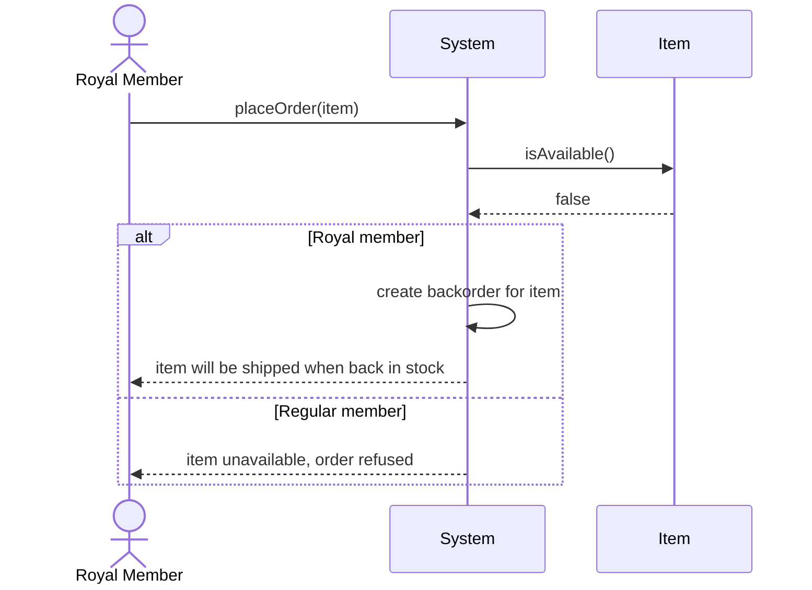
```mermaid
sequenceDiagram
    actor M as Royal Member
    participant S as System
    participant I as Item
    M->>S: placeOrder(item)
    S->>I: isAvailable()
    I-->>S: false
    alt Royal member
        S->>S: create backorder for item
        S-->>M: item will be shipped when back in stock
    else Regular member
        S-->>M: item unavailable, order refused
    end
```
